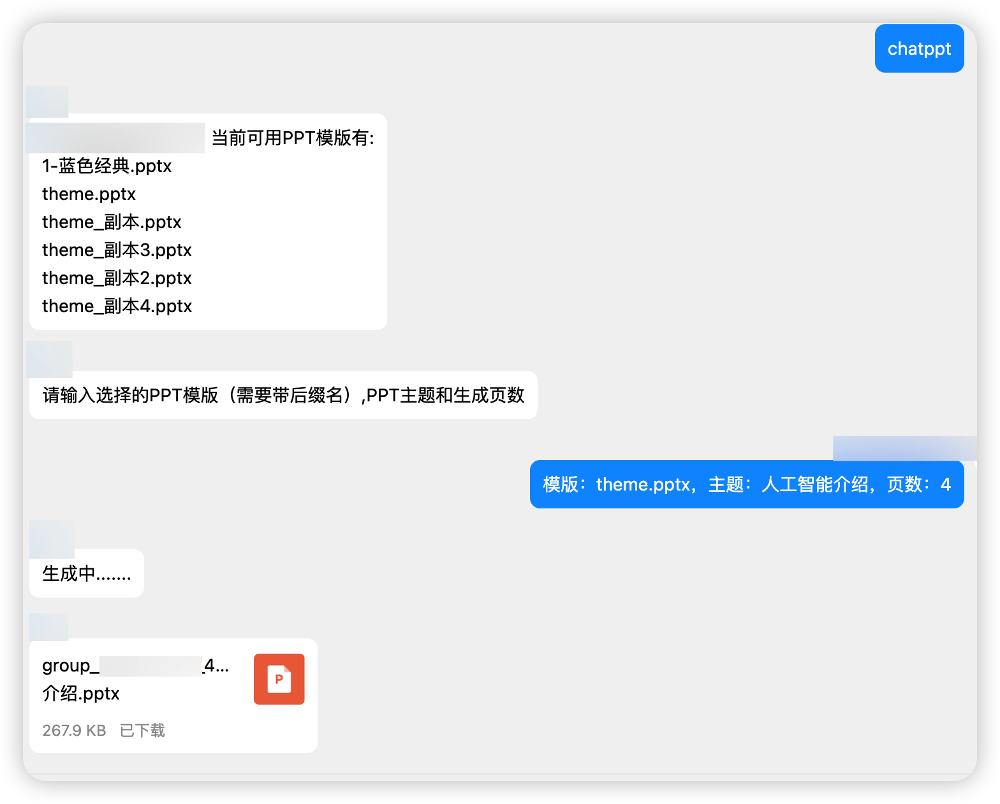

<div align="center">
  <a href="https://v2.nonebot.dev/store"></a>
  <br>
  <p></p>
</div>

<div align="center">

# nonebot-plugin-chatppt
</div>

## 介绍
- 本插件基于OpenAI的API开发，在nonebot框架下实现一个AI生成指定主题PPT的文件并上传到群文件中。


## 安装

* 手动安装
  ```
  git clone https://github.com/Alpaca4610/nonebot-plugin-chatppt.git
  ```

  下载完成后在bot项目的pyproject.toml文件手动添加插件：

  ```
  plugin_dirs = ["xxxxxx","xxxxxx",......,"下载完成的插件路径/nonebot-plugin-chatppt"]
  ```
* 使用 pip
  ```
  pip install nonebot-plugin-chatppt
  ```

## 配置文件

在Bot根目录下的.env文件中追加如下内容：

```
OPENAI_API_KEY = key
```

可选内容：
```
OPENAI_HTTP_PROXY = "http://127.0.0.1:8001"    # 中国大陆/香港IP调用API请使用代理访问api,否则有几率会被封禁
OPENAI_MODEL_NAME = "xxxxx"   # 使用的模型名称
SLIDES_LIMIT = "xxxxx"   # 生成PPT页数的上限，不设置默认为10
```


## 使用方法

- 生成PPT
```
chatppt 主题：XXXX，页数：XXXXX
```
- 删除当前用户缓存文件
```
删除缓存PPT
```
- 删除所有用户缓存文件
```
删除所有缓存PPT
```

## Todo

- [ ] 优化生成内容
- [ ] 完善插入图片功能

## 核心代码

核心代码来源于：[Python-PPTX-ChatGPT-Presentation-Generator](https://github.com/AmNotAGoose/Python-PPTX-ChatGPT-Presentation-Generator)
